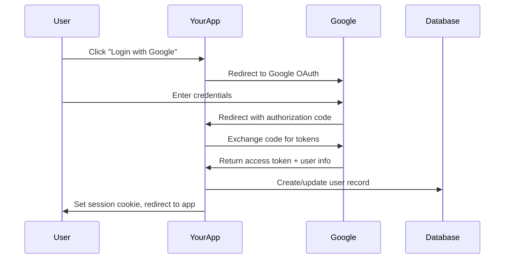

# Dependencies & Core Authentication Concepts

## 📦 Required Dependencies

### Production Dependencies

```bash
npm install next-auth @next-auth/prisma-adapter bcryptjs
```

### 1. `next-auth` - The Core Authentication Library

**What it does:**
- Provides complete authentication solution for Next.js
- Handles OAuth providers (Google, GitHub, etc.)
- Manages sessions (JWT or Database)
- Built-in CSRF protection
- TypeScript support

**Why NextAuth.js?**
- **Battle-tested**: Used by Netflix, TikTok, and thousands of companies
- **Security-focused**: Handles edge cases and vulnerabilities
- **Provider ecosystem**: 50+ OAuth providers supported
- **Flexible**: Works with any database or auth strategy

**Alternatives and why we didn't choose them:**
- **Auth0**: Third-party service, vendor lock-in, costs money at scale
- **Firebase Auth**: Google ecosystem lock-in, less customizable
- **Custom solution**: High risk of security vulnerabilities, time-consuming

### 2. `@next-auth/prisma-adapter` - Database Integration

**What it does:**
- Connects NextAuth.js to your Prisma database
- Translates NextAuth operations into Prisma queries
- Manages user data, sessions, and OAuth accounts

**Why use a database adapter?**
- **Data ownership**: Your user data stays in YOUR database
- **Complex queries**: Can build admin panels, analytics, user management
- **Relationships**: Link users to your app-specific data (properties, applications, etc.)
- **GDPR compliance**: Full control over data deletion and export

**How it works:**
```typescript
// When user logs in, adapter creates/updates database records
await adapter.createUser({ email: "user@example.com", name: "John" })
await adapter.createSession({ userId: "user123", expires: new Date() })
```

### 3. `bcryptjs` - Password Hashing

**What it does:**
- Securely hashes passwords before database storage
- Generates unique salts for each password
- Provides time-constant comparison functions

**Why bcryptjs over alternatives?**
- **bcrypt** (C++ bindings): Can break in serverless environments
- **bcryptjs** (Pure JS): Works everywhere, same security
- **argon2**: More secure but newer, less ecosystem support
- **scrypt**: Good option but bcrypt is industry standard

**Security concepts:**
```typescript
// Plain text password (NEVER store this)
const plainPassword = "myPassword123"

// Hashed password (safe to store in database)
const hashedPassword = await bcrypt.hash(plainPassword, 12)
// Result: "$2a$12$..."

// Verification (login process)
const isValid = await bcrypt.compare(plainPassword, hashedPassword)
```

## 🔐 Core Authentication Concepts

### Authentication vs Authorization

**Authentication: "Who are you?"**
- Verifying user identity
- Login process (email/password, OAuth)
- Session management
- Examples: Login form, Google OAuth, magic links

**Authorization: "What can you do?"**
- Controlling access to resources
- Role-based access control (RBAC)
- Permission systems
- Examples: Admin-only pages, user roles, feature flags

```typescript
// Authentication - NextAuth handles this
const session = await getServerSession(authOptions)
if (!session) {
  // User is not authenticated
  redirect('/login')
}

// Authorization - Your app logic handles this
if (session.user.role !== 'ADMIN') {
  // User is authenticated but not authorized
  throw new Error('Access denied')
}
```

### Session Management Strategies

#### Database Sessions (Our Choice)
**How it works:**
1. User logs in successfully
2. Server creates session record in database
3. Session ID stored in httpOnly cookie
4. On each request, server looks up session by ID
5. If valid and not expired, user is authenticated

**Advantages:**
- **Immediate revocation**: Delete from database = logged out
- **Server control**: Full control over session expiration
- **Security**: Session data not exposed to client
- **Tracking**: See all active sessions, detect suspicious activity

**Disadvantages:**
- **Database hit**: Every request requires database lookup
- **Scaling**: More complex for distributed systems

#### JWT Sessions (Alternative)
**How it works:**
1. User logs in successfully
2. Server creates JWT with user data
3. JWT stored in cookie or localStorage
4. Client sends JWT with each request
5. Server verifies JWT signature (no database lookup)

**Advantages:**
- **Stateless**: No database lookup needed
- **Scalable**: Works well with microservices
- **Fast**: No database hit on each request

**Disadvantages:**
- **Cannot revoke**: JWT valid until expiration
- **Size limits**: Cookies have size restrictions
- **Security risks**: Data exposed if JWT compromised

### OAuth 2.0 Flow (Simplified)



## 🤔 Why These Choices for Our Rental App?

### Database Sessions
- **User management**: Landlords need to see tenant accounts
- **Security**: Sensitive financial data requires immediate session control
- **Compliance**: GDPR requires data control and deletion capabilities

### Prisma Adapter
- **Integration**: User accounts link to properties, applications, payments
- **Admin features**: Need complex queries for property management
- **Data ownership**: Legal requirements for data residency

### bcryptjs
- **Serverless**: App will deploy to AWS Amplify (serverless environment)
- **Reliability**: No compilation issues, works everywhere
- **Industry standard**: Most companies use bcrypt family

## 📝 Key Takeaways

1. **NextAuth.js handles complexity**: OAuth flows, CSRF protection, session management
2. **Database sessions**: Better security and control for sensitive applications
3. **Prisma adapter**: Your data stays in your database, enables complex features
4. **bcryptjs**: Secure password hashing that works in all environments
5. **Authentication ≠ Authorization**: NextAuth handles identity, your app handles permissions

## 🧪 Quick Quiz

Before moving to the next section, make sure you understand:

1. What's the difference between authentication and authorization?
2. Why did we choose database sessions over JWT?
3. What does the Prisma adapter do?
4. Why can't we store plain text passwords?
5. What happens if we delete a session from the database?

**Answers:**
1. Authentication = "who are you?", Authorization = "what can you do?"
2. Database sessions allow immediate revocation and better security control
3. Connects NextAuth to our Prisma database, stores user data in our DB
4. Security risk - anyone with database access sees passwords
5. User is immediately logged out, session becomes invalid

---

**Next:** [Database Schema Deep Dive](./02-database-schema.md)