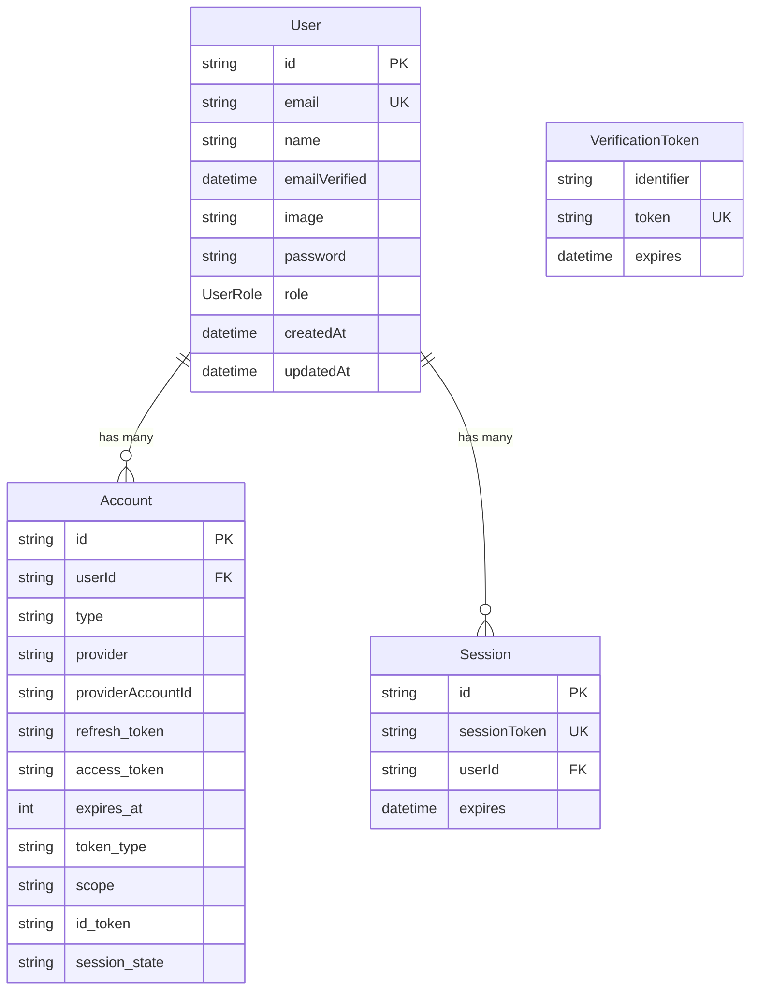

# Database Schema Deep Dive

## 🏗️ Entity Relationship Overview



## 📋 Table-by-Table Analysis

### 1. User Table - The Identity Hub

```prisma
model User {
  id            String    @id @default(cuid())
  name          String?
  email         String    @unique
  emailVerified DateTime?
  image         String?
  password      String?
  role          UserRole  @default(TENANT)
  createdAt     DateTime  @default(now())
  updatedAt     DateTime  @updatedAt

  accounts Account[]
  sessions Session[]

  @@map("users")
}
```

#### Field Analysis

| Field | Type | Required | Purpose | Why This Design? |
|-------|------|----------|---------|------------------|
| `id` | String (cuid) | ✅ | Primary key | CUID: collision-resistant, URL-safe, sortable |
| `email` | String (unique) | ✅ | Primary identifier | Email is stable, unique, required for contact |
| `name` | String? | ❌ | Display name | Optional: OAuth might not provide name |
| `emailVerified` | DateTime? | ❌ | Verification status | Null = unverified, DateTime = when verified |
| `image` | String? | ❌ | Profile picture URL | Optional: OAuth providers supply this |
| `password` | String? | ❌ | Hashed password | Optional: OAuth users don't need passwords |
| `role` | UserRole | ✅ | Authorization level | Custom: TENANT, LANDLORD, ADMIN |
| `createdAt` | DateTime | ✅ | Account creation | Audit trail, business analytics |
| `updatedAt` | DateTime | ✅ | Last modification | Audit trail, sync optimization |

#### Why Password is Optional

```typescript
// Scenario 1: Traditional signup
{
  email: "user@example.com",
  password: "$2a$12$...", // Hashed password
  emailVerified: null,      // Need to verify email
  name: "John Doe"
}

// Scenario 2: Google OAuth signup
{
  email: "user@gmail.com",
  password: null,           // No password needed
  emailVerified: new Date(), // Google already verified
  name: "John Doe",
  image: "https://lh3.googleusercontent.com/..."
}

// Scenario 3: User with both methods
{
  email: "user@example.com",
  password: "$2a$12$...",   // Can login with password
  emailVerified: new Date(),
  // ALSO has Account record for Google OAuth
}
```

### 2. Account Table - OAuth Provider Storage

```prisma
model Account {
  id                String  @id @default(cuid())
  userId            String
  type              String
  provider          String
  providerAccountId String
  refresh_token     String? @db.Text
  access_token      String? @db.Text
  expires_at        Int?
  token_type        String?
  scope             String?
  id_token          String? @db.Text
  session_state     String?

  user User @relation(fields: [userId], references: [id], onDelete: Cascade)

  @@unique([provider, providerAccountId])
  @@map("accounts")
}
```

#### Why Separate Account from User?

**Problem without separation:**
```prisma
// BAD: All OAuth data in User table
model User {
  id                String
  email             String
  googleId          String?  // What if user also has GitHub?
  googleAccessToken String?  // Mixing concerns
  githubId          String?  // Table gets unwieldy
  githubAccessToken String?  // Hard to add new providers
}
```

**Solution with separation:**
```prisma
// GOOD: Clean separation
model User {
  id       String
  email    String
  accounts Account[]  // Can have multiple providers
}

model Account {
  provider String     // "google", "github", "discord"
  // Provider-specific data here
}
```

#### OAuth Token Storage

```typescript
// When user logs in with Google:
{
  userId: "user123",
  type: "oauth",
  provider: "google",
  providerAccountId: "google-user-id-12345",
  access_token: "ya29.a0AfH6SMC...",      // For calling Google APIs
  refresh_token: "1//04qWGJ8qYZM...",     // For getting new access tokens
  expires_at: 1640995200,                 // Unix timestamp
  token_type: "Bearer",
  scope: "openid email profile",          // What permissions granted
  id_token: "eyJhbGciOiJSUzI1NiIs..."     // OpenID Connect identity token
}
```

#### The Unique Constraint

```prisma
@@unique([provider, providerAccountId])
```

**Why this constraint?**
- Prevents duplicate accounts for same provider
- One Google account = one Account record
- User can still have multiple providers (Google + GitHub)

**Example scenarios:**
```sql
-- ✅ ALLOWED: Same user, different providers
INSERT INTO accounts (userId, provider, providerAccountId) 
VALUES ('user123', 'google', 'google-id-1');
INSERT INTO accounts (userId, provider, providerAccountId) 
VALUES ('user123', 'github', 'github-id-1');

-- ❌ BLOCKED: Same provider account twice
INSERT INTO accounts (userId, provider, providerAccountId) 
VALUES ('user123', 'google', 'google-id-1');
INSERT INTO accounts (userId, provider, providerAccountId) 
VALUES ('user456', 'google', 'google-id-1'); -- FAILS: duplicate
```

### 3. Session Table - Active Login Tracking

```prisma
model Session {
  id           String   @id @default(cuid())
  sessionToken String   @unique
  userId       String
  expires      DateTime
  user         User     @relation(fields: [userId], references: [id], onDelete: Cascade)

  @@map("sessions")
}
```

#### Session Lifecycle

```typescript
// 1. User logs in successfully
const user = await authenticateUser(email, password)

// 2. Create session in database
const session = await prisma.session.create({
  data: {
    userId: user.id,
    sessionToken: generateRandomToken(), // Cryptographically secure
    expires: new Date(Date.now() + 30 * 24 * 60 * 60 * 1000) // 30 days
  }
})

// 3. Set cookie in browser
setCookie('next-auth.session-token', session.sessionToken, {
  httpOnly: true,    // JavaScript cannot access
  secure: true,      // HTTPS only
  sameSite: 'lax',   // CSRF protection
  expires: session.expires
})

// 4. On each request, verify session
const sessionToken = getCookie('next-auth.session-token')
const session = await prisma.session.findUnique({
  where: { sessionToken },
  include: { user: true }
})

if (session && session.expires > new Date()) {
  // User is authenticated
  return session.user
}
```

#### Why sessionToken is Unique

```prisma
sessionToken String @unique
```

- **Fast lookups**: Database can index and find sessions quickly
- **Security**: Prevents session token collisions
- **Clean logout**: Delete session by token = user logged out

### 4. VerificationToken Table - Email & Security Operations

```prisma
model VerificationToken {
  identifier String
  token      String   @unique
  expires    DateTime

  @@unique([identifier, token])
  @@map("verification_tokens")
}
```

#### Use Cases

**Email Verification:**
```typescript
// User registers with email
await prisma.verificationToken.create({
  data: {
    identifier: "user@example.com",
    token: generateRandomToken(),
    expires: new Date(Date.now() + 24 * 60 * 60 * 1000) // 24 hours
  }
})

// Send email: "Click this link to verify: /verify?token=abc123"
// User clicks link, we verify token and mark email as verified
```

**Password Reset:**
```typescript
// User requests password reset
await prisma.verificationToken.create({
  data: {
    identifier: "user@example.com",
    token: generateRandomToken(),
    expires: new Date(Date.now() + 1 * 60 * 60 * 1000) // 1 hour
  }
})

// Send email: "Reset password: /reset-password?token=xyz789"
```

**Magic Links (Passwordless Login):**
```typescript
// User enters email, wants to login without password
await prisma.verificationToken.create({
  data: {
    identifier: "user@example.com",
    token: generateRandomToken(),
    expires: new Date(Date.now() + 10 * 60 * 1000) // 10 minutes
  }
})

// Send email: "Login instantly: /magic-login?token=def456"
```

## 🏢 Rental App Specific Considerations

### User Roles & Authorization

```prisma
enum UserRole {
  TENANT     // Can: view properties, submit applications, pay rent
  LANDLORD   // Can: manage properties, review applications, collect rent
  ADMIN      // Can: manage system, view all data, moderate disputes
}
```

#### Role-Based Access Examples

```typescript
// Property creation - only landlords
if (session.user.role !== 'LANDLORD' && session.user.role !== 'ADMIN') {
  throw new Error('Only landlords can create properties')
}

// Admin panel - admin only
if (session.user.role !== 'ADMIN') {
  redirect('/dashboard')
}

// View application - applicant or property owner
if (
  application.userId !== session.user.id && 
  property.landlordId !== session.user.id &&
  session.user.role !== 'ADMIN'
) {
  throw new Error('Access denied')
}
```

### Future Schema Extensions

```prisma
// Future: Link users to business entities
model User {
  // ... existing fields
  
  // Relationships specific to rental app
  ownedProperties   Property[]    @relation("PropertyOwner")
  applications      Application[]
  leases           Lease[]
  payments         Payment[]
  maintenanceRequests MaintenanceRequest[]
}
```

## 🔐 Security Considerations

### Cascade Deletes

```prisma
user User @relation(fields: [userId], references: [id], onDelete: Cascade)
```

**What this means:**
- Delete user → All their accounts deleted automatically
- Delete user → All their sessions deleted automatically
- **GDPR compliance**: Complete data removal
- **Data integrity**: No orphaned records

### Data Retention

```typescript
// Session cleanup job (run daily)
await prisma.session.deleteMany({
  where: {
    expires: {
      lt: new Date() // Delete expired sessions
    }
  }
})

// Verification token cleanup
await prisma.verificationToken.deleteMany({
  where: {
    expires: {
      lt: new Date() // Delete expired tokens
    }
  }
})
```

## 📊 Performance Considerations

### Indexes

```sql
-- Automatically created by Prisma
CREATE UNIQUE INDEX "users_email_key" ON "users"("email");
CREATE UNIQUE INDEX "sessions_sessionToken_key" ON "sessions"("sessionToken");
CREATE UNIQUE INDEX "accounts_provider_providerAccountId_key" ON "accounts"("provider", "providerAccountId");

-- Consider adding for performance
CREATE INDEX "sessions_expires_idx" ON "sessions"("expires");
CREATE INDEX "verification_tokens_expires_idx" ON "verification_tokens"("expires");
```

### Query Optimization

```typescript
// ✅ GOOD: Select only needed fields
const user = await prisma.user.findUnique({
  where: { email },
  select: {
    id: true,
    email: true,
    role: true,
    // Don't select password hash
  }
})

// ❌ BAD: Selecting everything including password
const user = await prisma.user.findUnique({
  where: { email }
})
```

## 🧪 Understanding Check

Before moving on, ensure you understand:

1. **Why is the Account table separate from User?**
   - Supports multiple OAuth providers per user
   - Keeps OAuth-specific data separate from user identity

2. **How do database sessions work?**
   - Session token in cookie → Database lookup → User authentication

3. **What is the VerificationToken table for?**
   - Email verification, password reset, magic links

4. **Why is password optional in User table?**
   - OAuth users don't need passwords, supports multiple auth methods

5. **What does onDelete: Cascade mean?**
   - Deleting a user automatically deletes their accounts and sessions

---

**Next:** [NextAuth Configuration Deep Dive](./03-nextauth-configuration.md)